# Cutting the Cord: Designing a High-quality Untethered VR System with Low Latency Remote Rendering （Mobisys2018）

[toc]

链接: https://dl.acm.org/doi/10.1145/3210240.3210313

## 1 内容概述

这篇文章介绍了一个适用于端到端的VR系统，  
主要用到两种方法：
- 并行化渲染和流处理（Parallel Rendering and Streaming mechanism, PRS）
- 远程垂直同步渲染技术（Remote VSync Driven Rendering technique, RVDR）    

在无线网络条件下，满足高质量VR的延迟和视频质量的需求，因此作者称之是“无所束缚的”,"Cutting the Cord"这个标题也是蛮生动形象的。

结果显示该VR系统可以在60Ghz无线网络、2160x1200的分辨率、90Hz刷新率的条件下达到16ms以内的延迟，4K分辨率可以达到20ms以内，同时保证给用户展示出无损的画质。

## 2 背景
VR的设备主要分为两种，一种是**结合式**的，另一种是**独立式**的。

- **结合式VR**需要将头戴设备（*Head Mounted Display, HMD*）和PC连接起来，头戴设备通过USB线将传感器数据传输给PC，然后PC通过HDMI线将渲染的画面传回给头戴设备，这种方式可以是VR的画面质量更高清保真。

- **独立式VR**只是在单独一个设备上对画面进行操作，这种方式摆脱了“绳子的束缚”。

## 存在的问题

- **结合式VR**有“绳索的束缚”，用户行动不方便，甚至有安全隐患（比如被绳子缠绕脖子就麻烦了。。。hhh）
- **独立式VR**计算资源有限，没法做到高质量的画面渲染，有的人尝试用无线传输的方式将一些计算任务迁移到PC上，然而延迟会对画面帧率造成影响，使VR用户产生眩晕的感觉，严重影响用户体验。

## 3 延迟分析

对于无线的VR设备来说，端到端的延迟主要有以下几个组成部分：

$$
T_{e2e}=T_{sense}+T_{render}+T_{stream}+T_{display}
$$

其中，
$$
T_{stream}=T_{encode}+T_{trans}+T_{decode}
$$

$$
T_{trans}=\frac{FrameSize}{Throughout}
$$

每个部分的含义如下：  

- $T_{e2e}$: 端到端的延迟时间（从一个视频帧的产生再到它被显示出来的时间）
- $T_{sense}$: 服务器接收到HMD传感数据的时间
- $T_{render}$: 服务器根据传感数据生成一个新视频帧的时间
- $T_{stream}$: 将新视频帧从服务器传输到HMD的时间
    - $T_{encode}$: 在服务器上压缩（编码）一个新视频帧的时间
    - $T_{trans}$: 从服务器将压缩的帧通过无线网络传输到HMD的时间
    - $T_{decode}$: 在HMD上解压（解码）一个新视频帧的时间
- $T_{display}$: HMD将新视频帧显示出来的时间  

值得注意的是，$T_{display}$被考虑在了端到端的延迟中，这是因为，在现在的图像系统中，一个视频帧的显示是通过**VSync信号**驱动的，VSync信号是通过屏幕刷新率周期性生成的。如果一个帧错过了当前的VSync信号，那么它就需要在缓存队列中等待，直到下一次的VSync信号传来，才可以显示在屏幕上，对于90Hz的刷新率来说，平均等待时间是5.5ms，这个等待时间会对整体的延迟造成一定影响，所以这个时间也需要被优化。

$T_{sense}$和$T_{render}$是不能改变的，这篇文章主要针对通过优化$T_{stream}$（PRS）和$T_{display}$（RVDR）来减小整体端到端的延迟。

## 4 系统架构
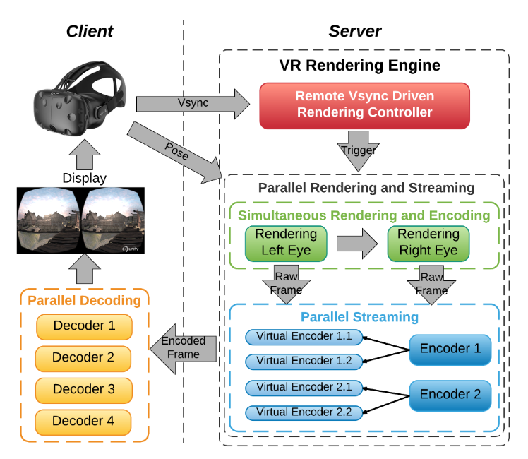

本文的系统架构如上图所示。首先，VR设备作为客户端向服务器发送垂直同步信号，以及用户的动作位姿信息，服务器端根据垂直同步信号时间决定渲染图像的具体时间，之后就是并行编码与传输环节，服务器同时进行渲染以及图像的编码，之后将压缩的视频帧传输到客户端，经过解码之后显示出来。

## 5 并行化渲染和流处理

这部分主要是为了减少上文所说的$T_{stream}$延迟，主要包含两部分：
- 同时渲染与编码
- 并行流处理

### 5.1 同时渲染与编码

渲染一个高质量的视频帧需要比较长的时间，甚至在一个高性能的显卡上也需要超过5ms的时间，我们又不能降低图像质量，因此需要寻找其他方法去减少这一部分的耗时，提出了一种同时渲染和编码的方法。

可行性主要有两点：
1. VR上的渲染通常分三步骤进行：（1）渲染左眼图像（2）渲染右眼图像（3）在整个视频帧加上镜头模糊，因此这种顺序渲染提供了一个机会，让我们可以在渲染右眼图像的同时开始对渲染好的左眼图像进行编码。
2. 现在的好多GPU有专用的硬件编解码部分，他们和渲染部分是相互独立的，因此即使利用GPU的编解码部分，也不会对渲染产生影响。

### 5.2 并行流处理

为了进一步减小视频流处理的时间，文中提出了一种多线程视频流处理的技术，利用多线程对每只眼睛的图像进行编码。

文中将每只眼的图像有分成两个slide，分别对应图像的上半部分和下半部分，因此整个视频帧对应4个slide，对应有四个编码线程和解码线程，结合前面提到的同时渲染与编码，过程如下图所示。

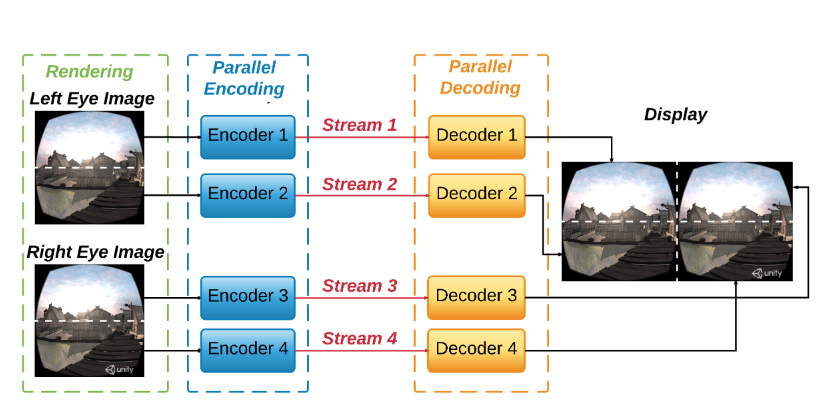

文中也解释了为什么这种分slide处理可以节约视频流处理的时间，如下图所示，

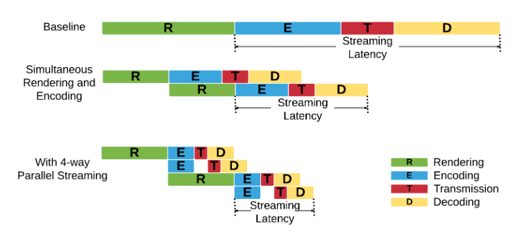

看到这里可能有人会问，岂不是线程数越多越好？

然而并不是这样，因为GPU上编解码部分并行的资源是有限的，而且分的slide太多会影响H.264编码的性能，对延迟造成影响，系统的实现也会变得更加复杂。

#### 编码器的多路复用

现在的商用GPU最多只支持两路视频同时压缩，而文中的方法需要4路，文中提出了多路复用的解决方法，如下图所示。

多路复用的思想：
- encoding session 1
    - left eye's upper half frame 
    - right eye's upper half frame 
- encoding session 2
    - left eye's bottom half frame 
    - right eye's bottom half frame 

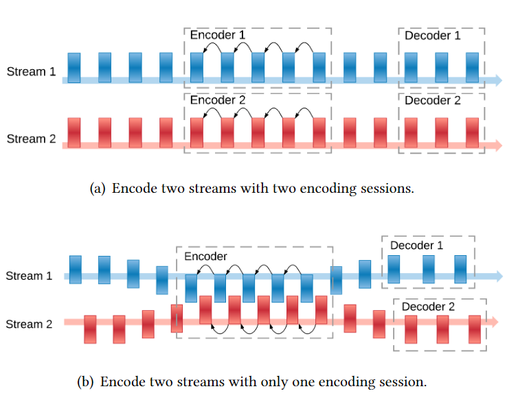

## 6 远程垂直同步渲染

### 6.1 问题阐述

为了保证流畅的用户体验，避免画面撕裂现象，通常采用双缓冲的机制，分为**前缓冲**和**后缓冲**。

**前缓冲**用来存放在屏幕上显示的帧，**后缓冲**用来存放渲染的帧，一旦接收到Vsync信号，系统将会交换两个缓存，将新渲染的视频帧显示出来。

如果有一帧系统渲染的很快，那么这个帧必须在后缓冲中等待下一次的VSync信号到来才能显示出来；如果有一帧系统渲染的很慢，以至于错过了下一次的VSync信号，那么它必须再继续等待后面的VSync信号，才能显示出来。

上面说的VSync驱动的渲染机制适用于本地的视频渲染画面展示，但是对于远程渲染会出现新的问题，因为远程渲染中，显示是在HMD上进行的，渲染是在远程服务器上进行的。

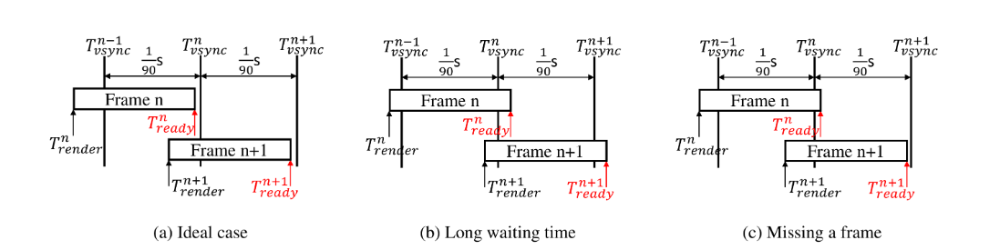

上图阐明了这个问题，$T_{render}^{n}$代表开始渲染的时间，$T_{ready}^{n}$代表的是渲染结束并在HMD上解码完成等待显示的时间，$T_{ready}^{n}-T_{render}^{n}$代表一个视频帧的是**生成时间**，(a)展示的是理想情况，(b)展示的是第n帧错过了VSync信号的情况，这会增加端到端的延迟，(c)展示的是第n帧错过了VSync信号，第n+1帧和第n帧在等待同一个VSync的情况，这是就不得不丢掉第n帧，这意味着对第n帧的渲染、编码、传输、解码的操作全都白费了。

为了证明这些问题是存在的，文中还测试了200多个连续视频帧的等待时间$\Delta T^{n}$，它代表$T_{ready}^{n}$和$T_{ready}^{n}$后最近的VSync信号时间的间隔，显示出了上文所说`Long waiting time`和`Missing a frame`的情况，如下图所示。

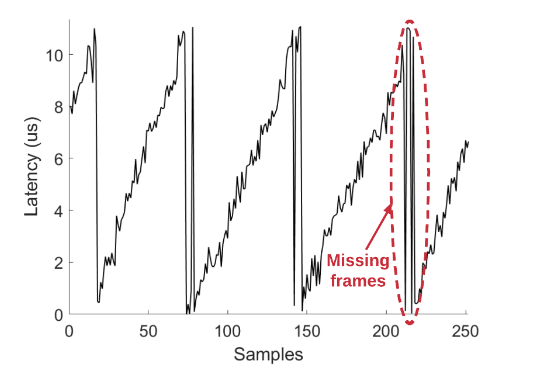

当然本地也会出现这样的问题，但是并不会像远程那样出现的很频繁。

### 6.2 解决方案

为了解决这个问题，作者利用HMD的VSync信号驱动远程服务器的渲染，核心思想就是，利用HMD传来的反馈，服务器决定渲染的时间，反馈信息包括当前帧的显示状态、等待时间以及HMD的移动。

第n帧渲染显示后，可以用下面的等式来表示第n+1帧的渲染时间：
$$
T_{render}^{n+1}=T_{render}^{n}+\frac{1}{90}s+T_{shift}
$$
在计算$T_{render}^{n+1}$和$T_{render}^{n}$的时间间隔时，除了考虑帧率90Hz，还引入了$T_{shift}$这个动态的偏移量，表示如下：
$$
T_{shift}=(T_{vsync}^{n}-T_{ready}^{n}-T_{conf}-T_{motion})*cc
$$

先不看$cc$，$T_{shift}$受多个因素影响，

第一个因素是第n帧的等待时间$T_{vsync}^{n}-T_{ready}^{n}$，如果将$T_{render}^{n+1}$向后推迟$T_{vsync}^{n}-T_{ready}^{n}$，假设每帧有相同的生成时间，那么$T_{ready}^{n+1}=T_{vsync}^{n+1}$，这样的话等待时间是最短的，但是一旦错过了VSync信号，那么很可能出现长等待或丢帧的现象，为了减少这种情况的发生，作者又引入了一个变量$T_{conf}$,使$T_{ready}^{n+1}$可以提前一些，避免错过VSync信号。

对于$T_{conf}$的设定，作者使用了一种统计的方法，首先将$T_{conf}$初始化为0，然后每1000帧记录前1000帧的生成时间，计算出置信度为99%的置信区间，将$T_{conf}$设置为置信区间的中点值。

第二个因素是HMD的移动，快速的移动会产生较大的画面变化，从而对应的渲染时间也比较长，因此需要进行提前渲染，以防错过VSync信号，HMD的移动快慢主要受平移和旋转变化的影响，由于帧率很高，平移不会带来很大变化，而旋转角度的影响比较大，因此$T_{motion}$延迟部分将旋转角度考虑进去，计算公式如下：

$$
T_{motion}=k*\Delta \theta^{n}
$$

最后$T_{shift}$乘了一个$cc$放缩因子，作为一个低通滤波器。

其中$k$和$cc$的值都是经验值，由作者自己定义，$cc=0.1$，$k=100$。

可以看出，这部分主要做的事情就是推迟下一帧的渲染时间，达到减小等待时间的目的，有人可能会觉得推迟渲染时间会不会让用户感受到不适，其实并不会，因为即使推迟了渲染时间，HMD的位置信息用的是最新的，而HMD位置信息更新频率达到了1000Hz，远比帧率大，因此这种方法是可行的。这样便尽可能的使垂直同步渲染处于一个理想的状态，既不产生较长的等待时间，也不丢帧，让视频帧的待显示时间一直处于下一次VSync信号到来之前，最小化用户的感知延迟，从而增强用户的实际体验。

## 7 系统实现

作者基于Windows系统进行实现，使用高通WiGig实现2.1Gbps无线传输，硬件用的都是商品硬件

### 7.1 硬件

- 渲染服务器
    - Intel Core i7 集显
    - Nvidia TITAN X GPU 独显
    - Mellanox 10Gbps 网卡，用10Gbps以太网有线连接一个Netgear Nighthawk X10 WiGig AP
- 客户端：ThinkPad X1 Yoga 笔记本
    - QualcommQCA6320/QCA6310 WiGig 模块
    - Intel i7-7600U CPU 
    - HD 620 Integrated GPU 包含 H.264 硬解码器 ASIC 
    - HDMI、USB连接HTC Vive HMD

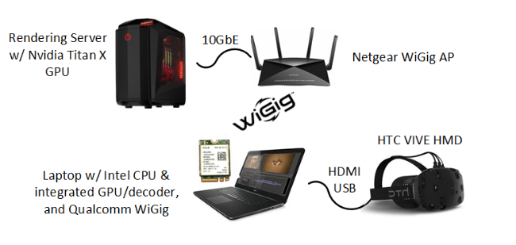

### 7.2 软件实现

#### 远程渲染

Unity渲染

Nvidia’s Video Codec低延迟渲染

修改了GoogleVR SDK中的 VR Camera，下图是与GoogleVR的不同

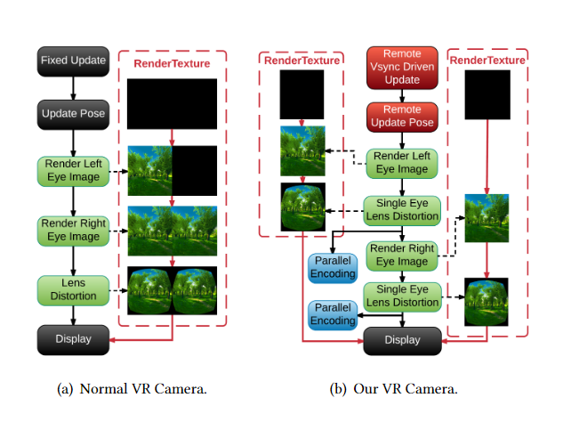

#### 并行编码

开发成了Unity本地插件，使用了GPU中的两个encoder产生4个视频流

#### 并行解码

使用Intel的集显解码，开启4个线程同时解码4路视频流，单独一个显示线程负责将解码的视频显示出来，OpenVR API可以解析VSync信号和位置信息，发送给server。

## 8 实验

使用四个VR视频，录制了同一个动作，在不同方法中回放

### 端到端的延迟

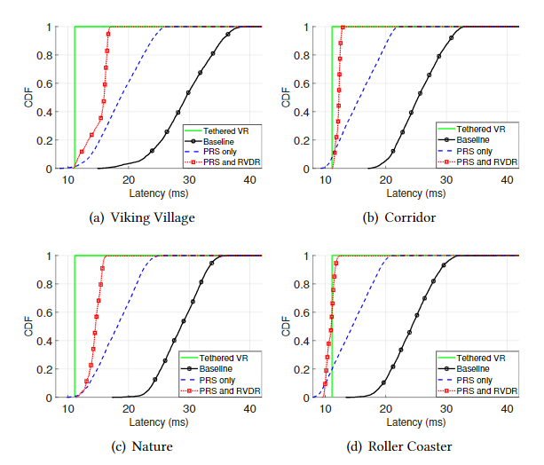

四种方法对比：
- 有线VR
- 无线VR-baseline
- 无线VR-只有PRS优化
- 无线VR-PRS+RVDR优化

可以看出有的场景，本文的方法性能和有线VR一样出色，而有的场景不如有线VR，这其实是渲染时间造成的。

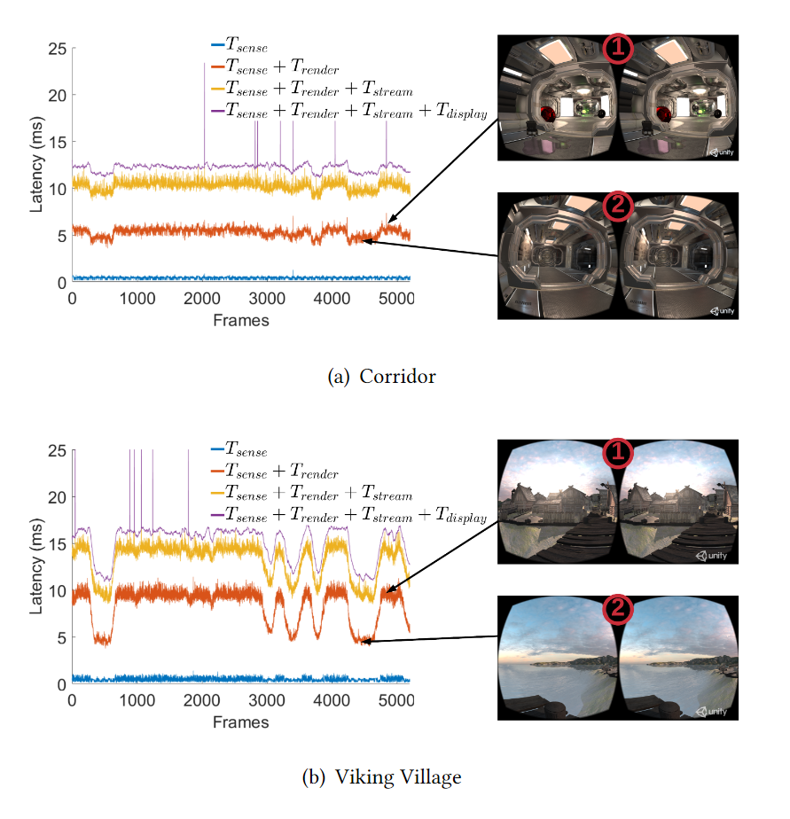

走廊的这幅图的渲染延迟5ms左右，而乡村需要10ms，场景的不同也会造成渲染时延的变化。

作者也分析了不同阶段的时延，视频流处理和显示时延都有明显的降低，如下图所示，

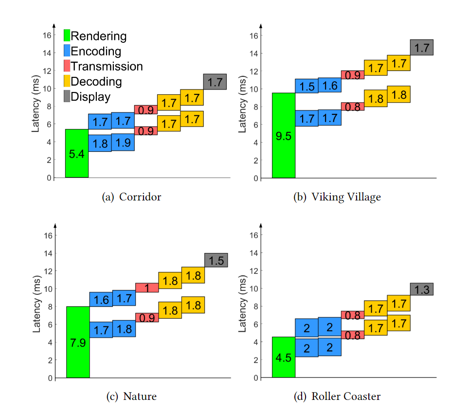

### 视频流延迟和视频质量

作者使用SSIM（Structural Similarity，结构相似度）作为评价视频质量的指标，SSIM指标如果大于0.98.可以认为视频质量是无损压缩的。

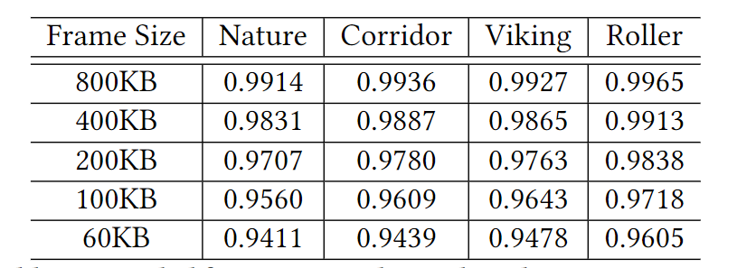

可见编码的Frame Size设置为400KB以上可以达到无损压缩的质量。

为了分析视频流延迟和视频质量的关系，作者做了一张不同的压缩质量对应视频流延迟的关系图，0.98的SSIM对应的视频流延迟仅有4ms左右，相对于baseline已经很小了。

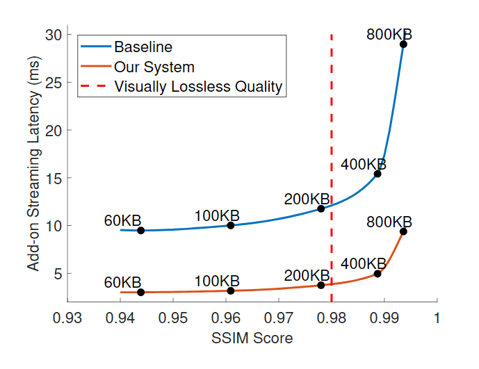

### 丢帧率

使用RVDR技术和不使用RVDR技术的丢帧率对比，下图可见RVDR技术有效降低了丢帧的概率。

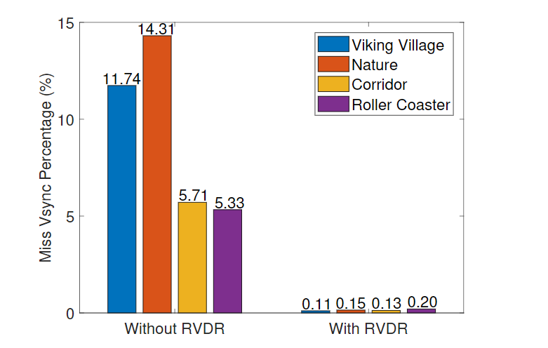

### 客户端资源消耗

正常情况下，windows 10的CPU使用率是3%-5%，文中VR系统运行时CPU的使用率达到36%左右，解码仅占用了GPU解码器29%的容量。

### 4K分辨率支持

作者又用同样的方法对4K分辨率的视频进行测试，并对不同部分的延迟进行分解，由于GPU不够强大，不足以支持4K渲染，因此渲染延迟比较大，当降低渲染质量时，本文的方法是可以支持4K视频的。

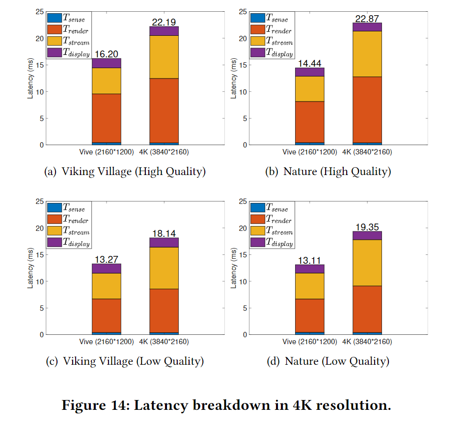